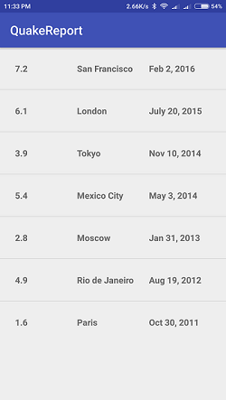

# QuakeReport
EarthQuake Report Project of Udacity Android Developer course

##Scrennshots
       

# Here we use concept of networking
 
 1)using listview and adapter we create a list of items that display the recent earthquakes.
  
 2)Create a layout for displaying the magnitude,location and time.
  
 3)In class earthquake,add getter and setter methods for all the 3 attributes i.e.magnitude,time and location.
  
 4)In class queryutils , write  code for JSON,which is used to convert the data that can be understood by the users.
  
 5)use formathdate() method and formattime() method to convert the date and time formats that can be understood by the users.
